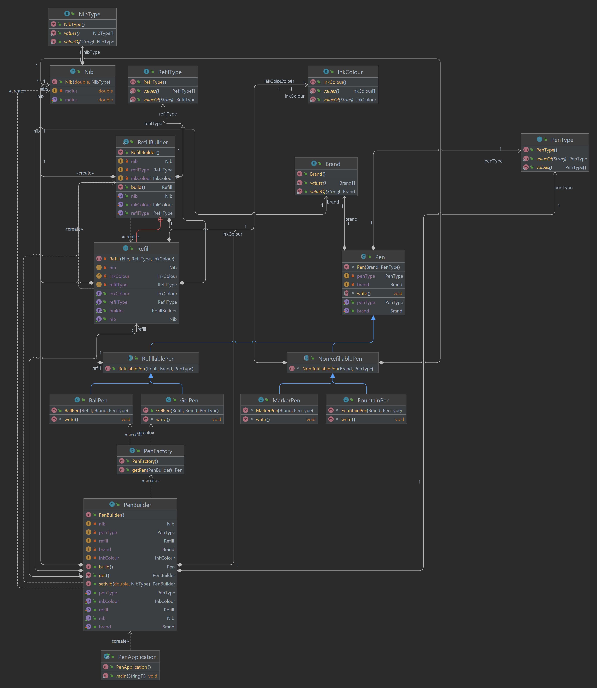

# Design a pen

#### Design a pen with below requirements :
- A pen can be ball pen, Gel pen, Fountain Pen and a Marker
- It can be refillable but not necessarily for every pen
- Ink can be of different colour
- Nib can be of different radius
- Refill can be transparent to track remaining ink
- A pen can have a brand
- Can have characteristics like : smooth, fast, sharp, long-lasting like writo-meter pen
- Can have cap mechanism or push-pull mechanism

## Class Diagram

